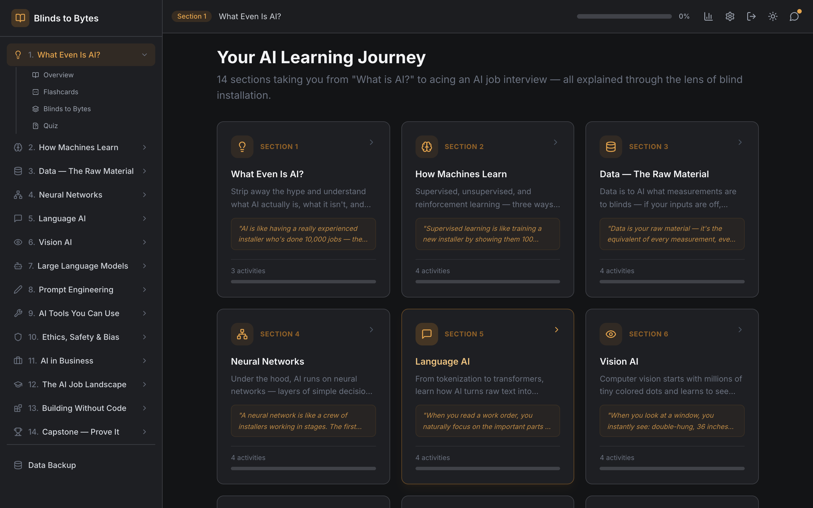
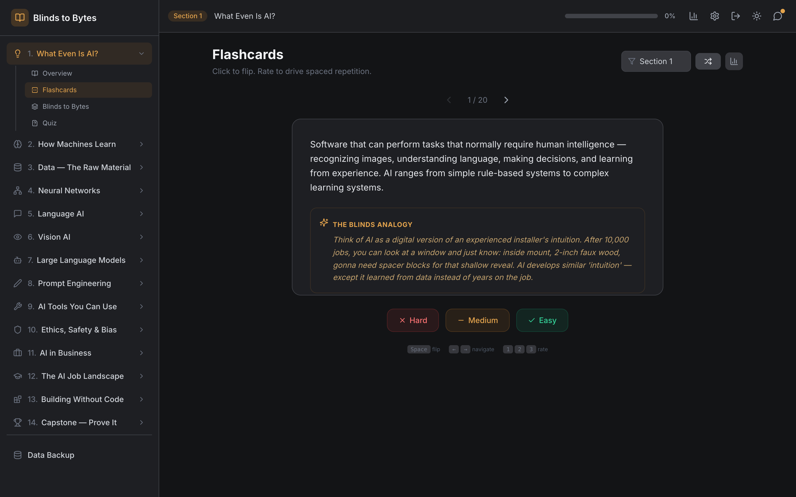
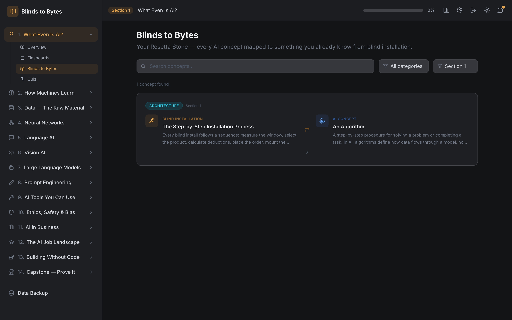
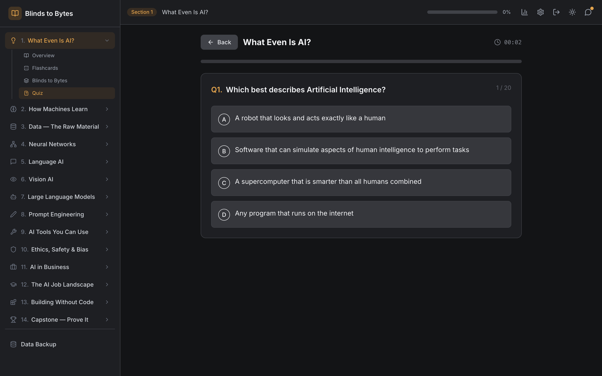
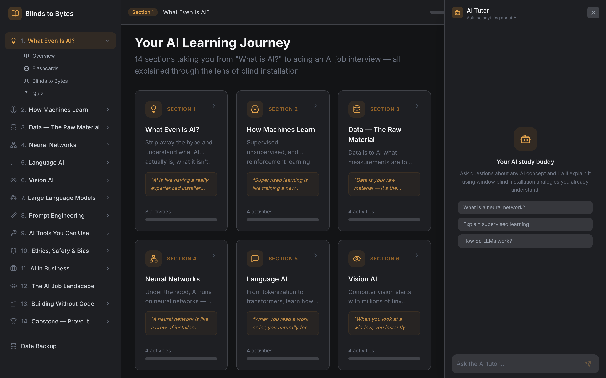
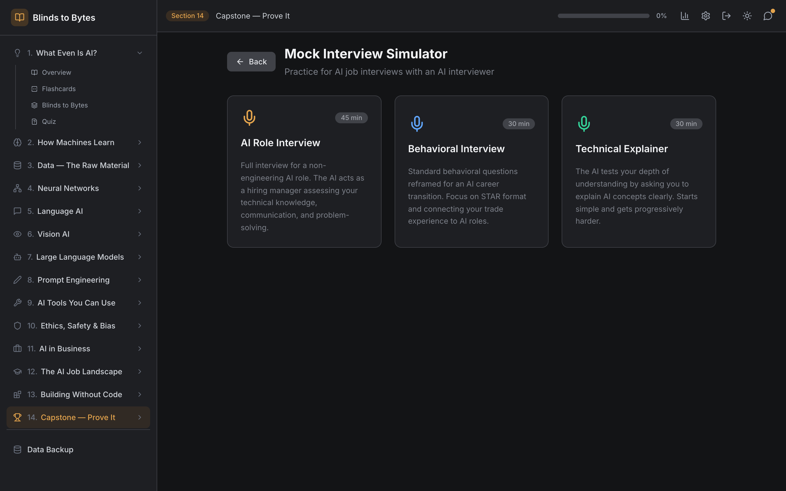
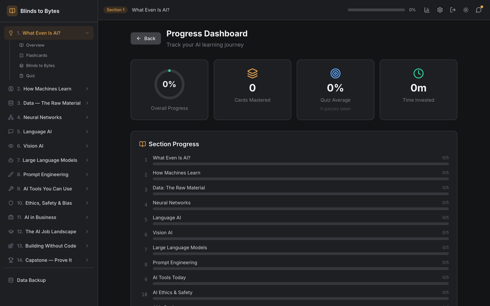
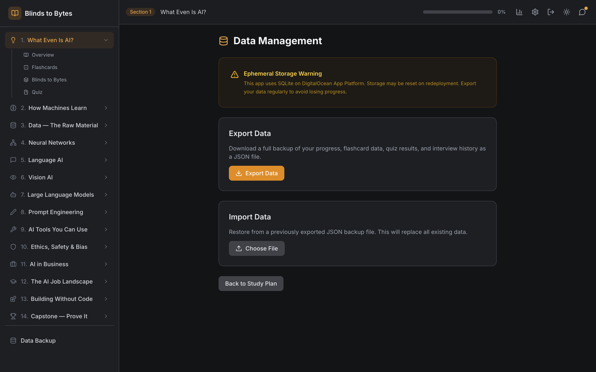
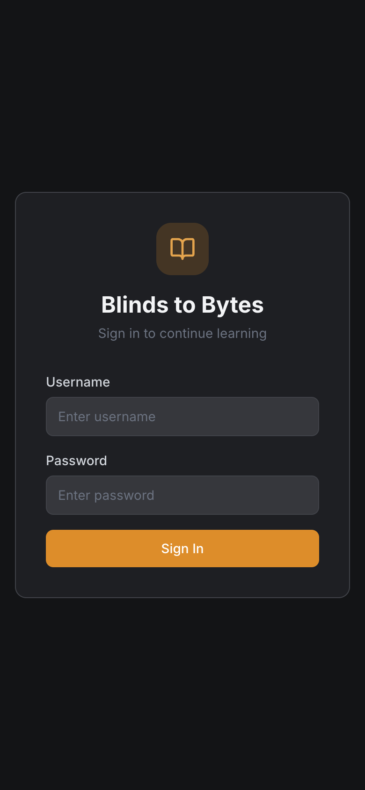
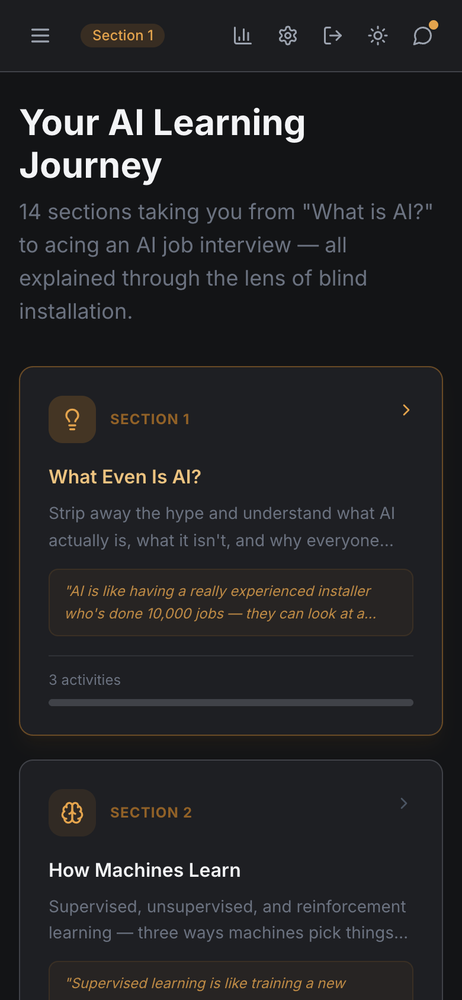

# Blinds to Bytes

**Learn AI through the lens of window blind installation.** A structured 14-section curriculum that takes you from "What is AI?" to acing an AI job interview — using analogies from the skilled trades you already understand.



## Why Blinds?

Every AI concept maps to something a blind installer already knows. Neural networks are like measuring window after window until muscle memory kicks in. Training data is like the spec sheet that tells you the product, the mount type, and the bracket count. Prompt engineering is like writing a clear work order so your crew installs exactly what the customer wants.

This app turns that intuition into structured learning with flashcards, quizzes, hands-on labs, and AI-powered tutoring.

## Features

### 14-Section Curriculum
From foundational concepts to a capstone project, each section includes an overview, flashcards, a "Blinds to Bytes" analogy explorer, interactive labs, and a quiz.

### Spaced Repetition Flashcards
Leitner box system with 5 levels. Rate each card as Easy, Medium, or Hard — the algorithm schedules reviews at increasing intervals as you master concepts.



Every card includes a **Blinds Analogy** that connects the AI concept back to something concrete from the trade.

### Blinds to Bytes Analogies
A searchable reference that maps every AI concept to its window blind installation counterpart, side by side.



### Timed Quizzes
20 multiple-choice questions per section with a running timer. Scores are tracked and displayed on the progress dashboard.



### AI Tutor Chat
A context-aware AI tutor that explains any concept using blind installation analogies. Available from any screen via the chat panel.



### Mock Interview Simulator
Three interview formats — AI Role, Behavioral, and Technical Explainer — powered by Claude. Practice answering real interview questions with AI feedback.



### Progress Dashboard
Track overall completion, flashcard mastery, quiz scores, time invested, and interview history at a glance.



### Data Backup & Restore
Export your entire learning history as JSON. Import it back after redeployment. Essential for ephemeral hosting environments.



### Mobile Responsive
Full mobile support with a collapsible sidebar, touch-friendly cards, and an adapted layout.

<p align="center">
  
  &nbsp;&nbsp;&nbsp;
  
</p>

## Tech Stack

| Layer | Tech |
|-------|------|
| Frontend | React 19, React Router, Tailwind CSS, Lucide icons |
| Backend | Express, better-sqlite3 |
| AI | Anthropic Claude API |
| Auth | JWT (single-user, env var credentials) |
| Build | Vite |
| Deploy | Docker, GitHub Actions CI, DigitalOcean App Platform |

## Getting Started

### Prerequisites

- Node.js 20+
- An [Anthropic API key](https://console.anthropic.com/)

### Local Development

```bash
git clone https://github.com/windoze95/blinds-to-bytes.git
cd blinds-to-bytes

# Install dependencies
npm install
cd client && npm install && cd ..

# Configure environment
cp .env.example .env
# Edit .env with your values:
#   ANTHROPIC_API_KEY=sk-ant-...
#   AUTH_USERNAME=your-username
#   AUTH_PASSWORD=your-password
#   JWT_SECRET=any-random-string

# Run in development mode
npm run dev
```

Open [http://localhost:5173](http://localhost:5173) (Vite dev server proxies API calls to port 3001).

### Docker

```bash
docker build -t blinds-to-bytes .

docker run -p 3001:3001 \
  -e ANTHROPIC_API_KEY=sk-ant-... \
  -e AUTH_USERNAME=your-username \
  -e AUTH_PASSWORD=your-password \
  -e JWT_SECRET=$(openssl rand -hex 32) \
  blinds-to-bytes
```

Open [http://localhost:3001](http://localhost:3001).

## Deployment

The app is configured for [DigitalOcean App Platform](https://www.digitalocean.com/products/app-platform) with auto-deploy on push to `main`.

### Setup

1. Fork or push this repo to your GitHub account
2. [Install the DigitalOcean GitHub app](https://cloud.digitalocean.com/apps/github/install) and grant access to the repo
3. Create the app:
   ```bash
   doctl apps create --spec .do/app.yaml
   ```
4. Set secrets in the DO dashboard (or via `doctl apps update` with values in the spec):
   - `ANTHROPIC_API_KEY`
   - `AUTH_USERNAME`
   - `AUTH_PASSWORD`
   - `JWT_SECRET`

### SQLite & Ephemeral Storage

DigitalOcean App Platform uses ephemeral containers — the SQLite database resets on each deploy. Use the **Data Management** page (Settings > Data Backup) to export before redeploying and import after.

Automated daily backups run via GitHub Actions and are downloadable from the Actions tab for 90 days.

## CI/CD

**On push/PR to `main`:**
- Builds the Docker image
- Runs the container with test credentials
- Health checks: homepage 200, bad login 401, unauthed API 401

**Daily at 2am UTC:**
- Calls the production export endpoint
- Uploads the backup JSON as a GitHub Actions artifact

## Project Structure

```
blinds-to-bytes/
  client/                  # React frontend
    src/
      components/          # UI components
        Auth/              # Login page
        BlindsToBytes/     # Analogy explorer
        Flashcards/        # Spaced repetition cards
        Layout/            # Sidebar, TopBar, ChatPanel
        Labs/              # Interactive labs
        MockInterview/     # AI interview simulator
        Progress/          # Dashboard
        Quiz/              # Timed quizzes
        Scenarios/         # Real-world scenarios
        Settings/          # Data backup/restore
        StudyPlan/         # Section overview cards
      context/             # React context (auth + app state)
      data/                # Flashcard & quiz content
      hooks/               # useAI, useProgress
      utils/               # apiFetch (auth wrapper)
  server/                  # Express backend
    db/                    # SQLite schema & seed
    middleware/            # JWT auth middleware
    routes/                # API routes (ai, auth, data, progress)
  .do/                     # DigitalOcean app spec
  .github/workflows/       # CI + daily backup
  Dockerfile               # Multi-stage production build
```

## License

MIT
